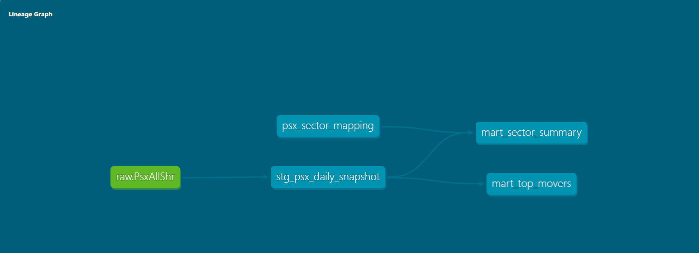

# PSX Data Engineering Pipeline

An end-to-end data engineering project that ingests daily Pakistan Stock Exchange (PSX) market data, transforms it through a Medallion architecture using dbt, and serves analytics-ready datasets for market analysis.

## Architecture

```
PSX Website → Python Scraper → PostgreSQL Bronze Layer (PsxAllShr)
                                            ↓
                                 dbt Staging Model (Silver)
                                            ↓
                          ┌─────────────────┴─────────────────┐
                          ↓                                   ↓
               mart_top_movers (Gold)          mart_sector_summary (Gold)
```

## Tech Stack

| Layer | Technology |
|---|---|
| Ingestion | Python, psycopg2 |
| Storage | PostgreSQL (Neon) |
| Transformation | dbt-core, dbt-postgres |
| Data Quality | dbt tests (not_null, unique) |
| Scheduling | Windows Task Scheduler |
| Version Control | Git, GitHub |

## Project Structure

```
PSX-Financial-Agent/
├── PSX-Data-Pipeline/                       # Python ingestion scripts
│   └── extract-psx-data.py                  # Scrapes and loads daily PSX data
└── psx_analytics/                           # dbt project
    ├── models/
    │   ├── staging/
    │   │   ├── stg_psx_daily_snapshot.sql   # Bronze → Silver transformation
    │   │   ├── stg_psx_daily_snapshot.yml   # Column-level data quality tests
    │   │   └── sources.yml                  # Raw source definition
    │   └── marts/
    │       ├── mart_top_movers.sql          # Daily top & bottom movers
    │       └── mart_sector_summary.sql      # Sector-level aggregations
    └── seeds/
        └── psx_sector_mapping.csv           # Symbol to sector mapping
```

## Data Models

### Bronze Layer — `PsxAllShr`
Raw daily snapshot ingested directly from PSX. All fields stored as-is (TEXT), completely untouched. Serves as the immutable source of truth.

### Silver Layer — `stg_psx_daily_snapshot`
Cleaned and typed view built on top of raw data. Strips commas and percentage signs, casts all numeric fields to correct types, and nullifies empty strings.

### Gold Layer — `mart_top_movers`
All 285 PSX-listed stocks ranked by daily change percentage. Rebuilt as a table on every pipeline run.

### Gold Layer — `mart_sector_summary`
Sector-level aggregations per day — total market cap, total volume, average change percentage, and average price grouped by sector.

## Data Quality

dbt tests run automatically on every pipeline execution:

| Column | Tests |
|---|---|
| `id` | unique, not_null |
| `symbol` | not_null |
| `fetched_at` | not_null |
| `current_price` | not_null |

## Lineage Graph



## Setup

### Prerequisites
- Python 3.11+
- PostgreSQL instance (Neon free tier works)
- dbt-core, dbt-postgres

### Installation

```bash
git clone https://github.com/muzzamilanis/PSX-Financial-Agent
cd PSX-Financial-Agent
python -m venv .venv
.venv\Scripts\Activate.ps1
pip install dbt-postgres
```

### Configure dbt

Create `~/.dbt/profiles.yml`:

```yaml
psx_analytics:
  target: dev
  outputs:
    dev:
      type: postgres
      host: your-neon-host
      port: 5432
      user: your-user
      password: your-password
      dbname: PsxDataLake
      schema: raw
      threads: 1
      sslmode: require
```

### Run the Pipeline

```bash
# Load sector mapping seed
dbt seed

# Run all transformation models
dbt run

# Run data quality tests
dbt test

# Generate and serve documentation
dbt docs generate
dbt docs serve
```

## Sample Output

**Top movers — 2026-04-28:**

| Symbol | Name | Price (PKR) | Change % | Volume |
|---|---|---|---|---|
| TRSM | Trust Modaraba | 17.24 | +10.02% | 2,082,863 |
| MSCL | Metropolitan Steel Corporation | 26.25 | +10.02% | 2,021,553 |
| FCEPL | Frieslandcampina Engro Pakistan | 85.87 | +10.01% | 1,842,353 |
| PREMA | At-Tahur Limited | 35.93 | +10.01% | 2,558,983 |

**Sector summary — 2026-04-28:**

| Sector | Stocks | Avg Change % | Total Market Cap (M) |
|---|---|---|---|
| Oil & Gas Exploration | 3 | -0.75% | 2,759,643 |
| Fertilizer | 2 | -0.95% | 1,011,184 |
| Cement | 2 | -1.32% | 732,124 |
| Technology & Communication | 2 | +0.40% | 238,191 |

## Roadmap
- [ ] Expand sector mapping to all 285 symbols
- [ ] Add Prefect orchestration
- [ ] Build analytics dashboard (Metabase / Superset)
- [ ] Add historical trend marts (30-day moving average, relative strength index)
- [ ] Automate dbt runs via GitHub Actions

## Author
Muhammad Muzzamil
[LinkedIn](https://linkedin.com/in/muzzamil-nagda) · [GitHub](https://github.com/muzzamilanis)